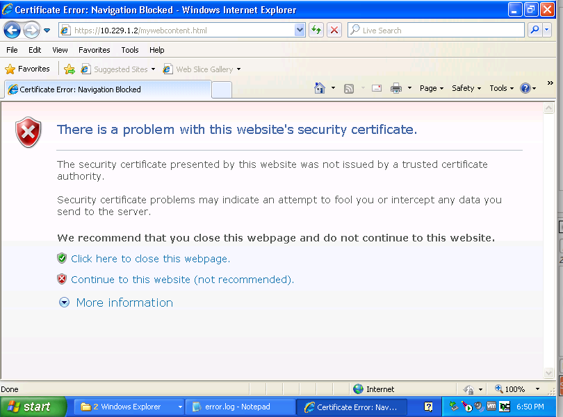
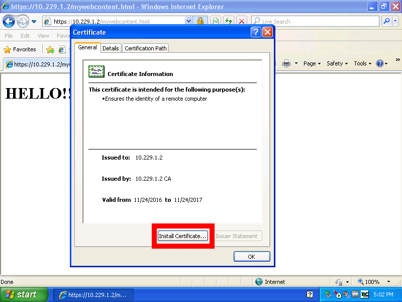
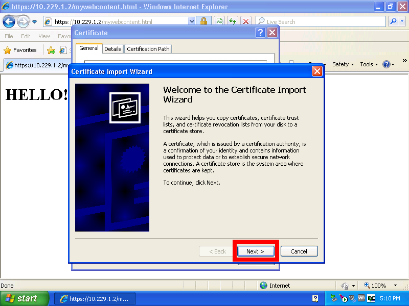
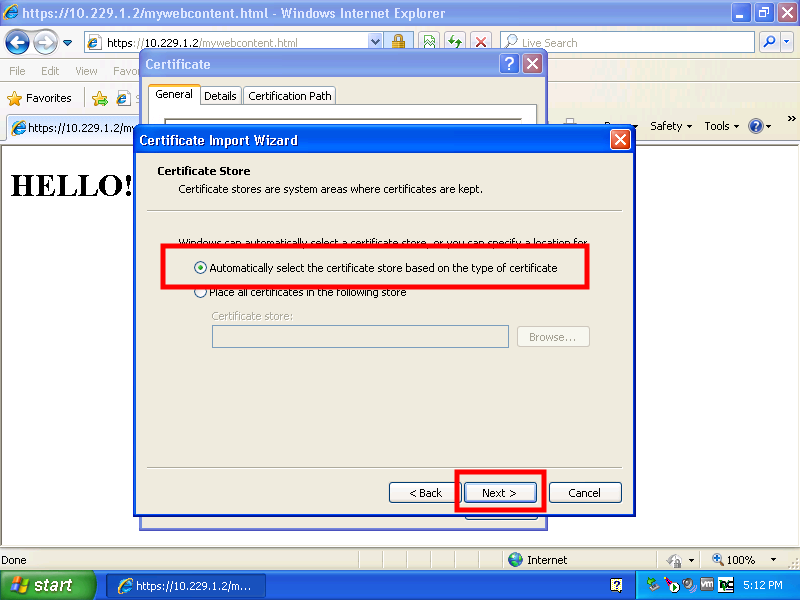
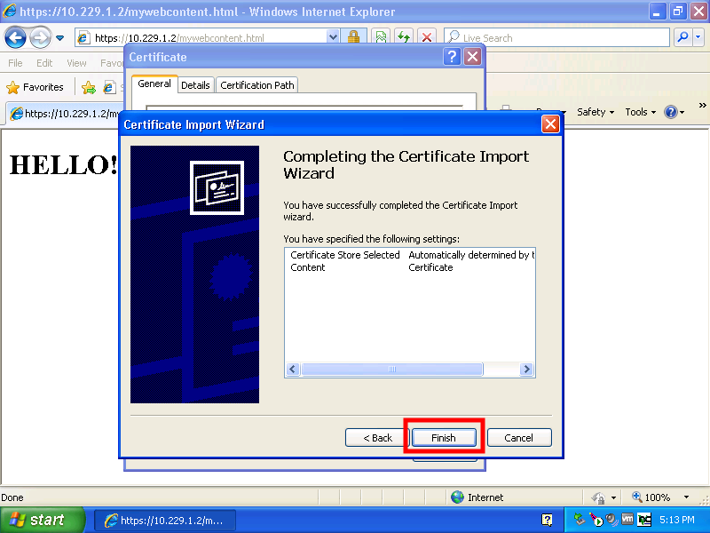
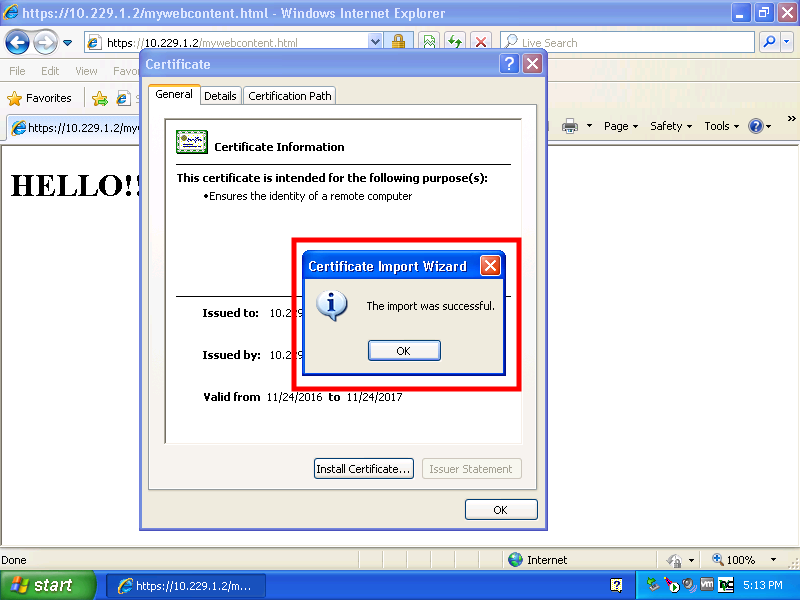
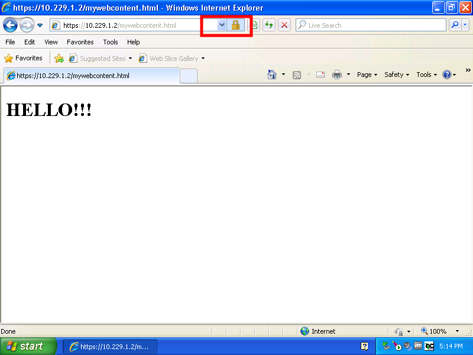
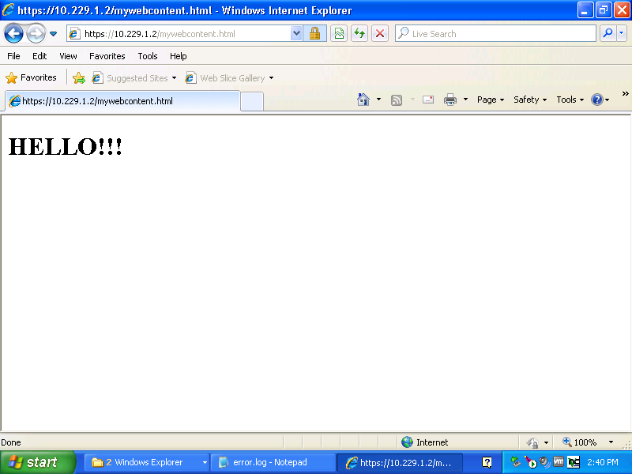

## Assignment 2 Sliding Part

### Question 1

- To get the public/private key pair, we used the command "openssl genrsa -des3 -out ca.key 4096". This command creates a key of 4096 bits using des3. We then use this key to create the certificate using the command "openssl req -config ~/../etc/ssl/openssl.cnf -new -x509 -extensions v3_ca -keyout ca.key -out ca.crt -days 365"

- Password to key files is "KitHpwuaaUni". "ca.crt" is the Certificate Authorities crt, "ca.key" is the Certificate Authorities key. The ca.crt file is important because it is required to be used with the ca.key to sign a server certificate. 

### Question 2

- Using the command "openssl genrsa -des3 -out server.key 4096" we create a key with 4096 bits long using des3. This server.key file is then used to create the Servers Certificate request file using the command "openssl req -new -key server.key -out server.csr". This will take the key and use it to create the .csr file.

- "server.csr" is the Servers Certificate request. This file is used as an in parameter with ca.key and ca.crt to sign the server certificate so that it will be an "official and trusted" certificate.

### Question 3

- Using the command "openssl ca -policy policy_anything -config /etc/ssl/openssl.cnf -days 365 -in server.csr -CA ca.crt -CAkey ca.key -set_serial 01 -out server.crt" we create the Servers Certificate. This uses the certificate request file along with the the key and certificate that is used to be the certificate authority named ca.cy and ca.key. We allow the certificate to exist for one year until you it expires and a new one has to be created. We set serial to be 01 so that when it comes time to renew the certificate we can set it to 0n where n is the newest number of certificates (02 for 2nd cert, 03 for 3rd cert). 

-We need to use policy_anything as the policy because the default is policy_match which needs country Name, state or Province Name, and organization Name to match exactly with the addition of common Name being provided. Policy_anything allows that only common Name is supplied and all other parameters are optional. So if we did not set the policy to be policy_anything then it would have failed because of the exact matching of the country Name, state or province name and organization name may or may not be exact or provided.

### Question 4

Modifying the http-ssl.conf file located in the Apache files, edit the <Virtualhost> fields such that you include the needed SSL requirements. Look into the apache files to gather correct items.

- We first start by allowing port 443 through the windows firewall.

- In the http.conf file located wherever you have Apache installed, we first add the LoadModule ssl_module modules/mod_substitute.so at the top of the conf file. This initially loads in all the sll information that we need to use to start using Certificate Authorities. We also need to add "Include conf/extra/httpd-ssl.conf" to the http.conf file as this is where the <VirtualHost> is set up. The path to httpd-ssl.conf is wherever you have that file located.

- We then need to edit <VirtualHost> so that we can use our certificate. Ensure that this conf file is listening on port 443 and that the header of <virtualHost> is in the format of <VirtualHost _defualt::443> where _default_ is the ip address of the host server.

- Mapping the correct certificate files and keys:

/t - <b>Server Certificate:</b> SSLCertificateFile "C:/Program Files/Apache Software Foundation/Apache2.2/conf/server.crt". This needs to be set to whatever you have as your server.crt.

/t - <b>Server Private Key:</b> SSLCertificateKeyFile "C:/Program Files/Apache Software Foundation/Apache2.2/conf/server.key". This needs to be set to whatever you have as your server.key.

/t - <b>Certificate Authority (CA):</b> SSLCACertificateFile "C:/Program Files/Apache Software Foundation/Apache2.2/conf/ca.crt". This needs to be set to whatever you have as the CA.

### Question 5

Screenshot of web server not recognizing the certificate is called "BeforeCertificate.png". 

Steps to install certificate:

- Step 1: View the certificate that is unrecognized. Select Install Certificate at the bottom of the window after viewing the certificate.

- Step 2: Select the Next button.

- Step 3: Select the first radio button (Automatically select ...). Then select the Next button.

- Step 4: Select the Finish button.

- Step 5: Import should be successful and show a dialog box. Select OK button.

- Step 6: Near the address bar, there should be a lock image to show that the certificate has been successful and approved.

Screenshot of web server successfully loading in the certificate is called "AfterCertificate.png"

- Some of the problems that we encountered was after installation of the certificate, it still said that it was an untrusted site even though it accepted the certificate. Closing the explorer and restarting the windows VM seemed to solve that issue though.

### Question 6

Write up the process of	how to generate signed Java code and explain what is the purpose of each step (WHY each step is needed). What (if any) are the differences with respect to the web server certificates?